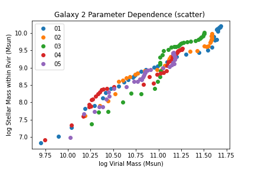

More Advanced Plotting
=========================

While the three types of plots (errorbars, scatterplots, heatmaps) are designed to work automatically with any choice of input or output variables, different choices of variables necessarily create different types of output plots. The three recognized types of variables are:

* Continuous sightline parameters: this includes all outputs from the code's ``run_sightlines`` function, including all formulas.
* Discrete sightline parameters: this includes the impact parameter (both in kpc and in "reduced" form as a fraction of impact parameter), as well as the polar and azimuthal angles of the viewing angle.
* Snapshot parameters: these are numbers associated with the galaxy snapshot metadata, including redshift, stellar mass, star formation rate, and any other parameters given in your ``galaxy_catalogs`` file.
* Snapshot "stringparams": These are ``strings`` associated with the galaxy snapshot metadata, including the simulation name, version, and number. You can't plot stringparams as x or y variables, but you can use them to "sort" the QuasarSpheres into bins.

Internally, the code distinguishes between five "types" of plots.

* type 0: multiple continuous ``y`` variables plotted against one continuous, discrete, or snapshot ``x`` variable. This is triggered when passing a list of variables or formulas as ``yVar``. In this case, different colors will be assigned to each element of the list. The QuasarSpheres cannot be sorted or distinguished in this case, this will combine together all of ``mq``'s remaining QuasarSpheres and plot them together. A "type 0" plot will really implement one of the below types, depending on the variables given, thus will take different forms (see below).
* type 1: one continuous ``y`` variable plotted against one discrete ``x`` variable. This is triggered when passing a single variable or formula as ``yVar``, and choosing one of the discrete sightline parameters as ``xVar``. If ``lq`` is specified, it will plot the QuasarSpheres in each of its bins as a different color. If ``lq`` is not specified, it will combine all of ``mq``'s remaining QuasarSpheres and plot the values in one color under the label 'all'. Errorbar plots will have vertical errorbars, but not horizontal (discrete parameters have no error).
* type 2: one continuous ``y`` variable plotted against one snapshot ``x`` variable. This is triggered when passing a single variable or formula as ``yVar``, and choosing one of the snapshot parameters as ``xVar``. If ``lq`` is specified, it will plot the QuasarSpheres in each of its bins as a different color. If ``lq`` is not specified, it will combine all of ``mq``'s remaining QuasarSpheres and plot the values in one color under the label 'all'. Errorbar plots will have vertical errorbars, but not horizontal (snapshot parameters have, at present, no calculated errors).
* type 3: one snapshot ``y`` variable plotted against one snapshot ``x`` variable. This is triggered when passing a single snapshot variable as ``yVar``, and choosing one of the snapshot parameters as ``xVar``. If ``lq`` is specified, it will plot the QuasarSpheres in each of its bins as a different color. If ``lq`` is not specified, it will combine all of ``mq``'s remaining QuasarSpheres and plot the values in one color under the label 'all'. The usual use case for this is that we will only have a relatively small number of snapshots, and errorbars would be misleading or not useful for binning them. So, in this case no errorbars will appear, only discrete points for each galaxy snapshot. Note that this type of plot, while useful for data exploration, does not use the sightlines created in ``quasarscan`` at all.
* type 4: one continuous ``y`` variable plotted against one continuous ``x`` variable. This is triggered when passing a single variable or formula as ``yVar``, and choosing another variable or formula as ``xVar``. If ``lq`` is specified, it will plot the QuasarSpheres in each of its bins as a different color. If ``lq`` is not specified, it will combine all of ``mq``'s remaining QuasarSpheres and plot the values in one color under the label 'all'. Errorbar plots will have both vertical and horizontal errorbars.

Plotting Observations
^^^^^^^^^^^^^^^^^^^^^

Each of the plot types can be reproduced with obervational data, instead of just simulation data, but some additional setup is needed. First, you need to add observational sightline data to the ``quasarscan_data`` folder in a second folder called ``observations``. Its format is very similar to the galaxy_catalog snapshot, except it will have both sightline and galaxy information. At the top of the file, a line is needed which includes all the data variables, such as ``Rvir``, ``Mvir``, ``Ne VIII`` (or any other ion). You can also add for each variable another variable "<varname>:eb" which stands for "errorbar". This can take either a float value, which is interpreted as the positive and negative difference in that variable, or the characters "<" and ">", indicating an upper and lower limit, respectively.

Any plot_type can be created using observational data, simply by using the keyword ``qtype='obs'``, it will look up all existing loaded observations. They can be filtered and restricted in exactly the same way as normal QuasarSpheres. Unlike normal QuasarSpheres, however, observations are never averaged. Each data point has its own x and y error (if known) and so each will be plotted separately. If lower or upper limits are given instead, the mark will be unfilled and with an arrow in the appropriate direction. 

To plot simulations and observations on a single plot, just use the ``ax`` returned by one plot again. For example:

.. code-block:: python

 mq = quasarscan.create_mq()
 lq = mq.sort_by('redshift',[0,1.05,2.05])
 fig,ax = mq.plot_err('O VI','rdivR',lq=lq)
 mq.plot_err('O VI','rdivR',lq=lq,qtype='obs',ax = ax)
 fig.savefig('quasarscan/docs/source/_images/OVI_observations')

Plotting "Empty" Data
^^^^^^^^^^^^^^^^^^^^^

You can also plot your snapshots before you've actually created and run sightlines for them, just by using the metadata. Obviously, since there's no sightlines, only type 2 plots can actually be created. For example:

.. code-block:: python

 mq = quasarscan.create_mq(loadempty='all')
 mq.constrain_current_quasar_array('simname',['VELA'], qtype = 'sim')
 lq = mq.sort_by('redshift',[0,1.05,2.05])
 ax = mq.plot_scatter('O VI','H I',lq=lq)
 mq.plot_scatter('Mstar','Mvir',lq=lq,qtype='empty')

Faberplots
^^^^^^^^^^^

Sometimes you want to explore data in many variables. One way to add two additional variables to your plot is to plot a 2D set of panels of 2D images with colors, giving thus up to 5 total variables. We named this a "Faberplot" after many requests for plots of this kind from our esteemed collaborator Prof. Sandra Faber. To create a Faberplot, one needs to first perform a 2D "sort" function. This is similar to the main ``sort_by`` function, but with two separate variables. 

.. code-block:: python

 lq2 = sort_by_2D(criteria_x,\
                  criteria_y,\
                  bins_x = [0,np.inf],\
                  bins_y = [0,np.inf],\
                  at_end_x = False,\
                  at_end_y = False,\
                  split_even_x = False,\
                  split_even_y = False,\
                  reverse_x = False,\
                  reverse_y = False)

Where each argument is the same as in ``sort_by`` but with an ``_x`` or ``_y`` appended to the end. Like before, lq2 contains the labels, bins, and a 2D array of QuasarSpheres. The ``faberplot`` is called with:

.. code-block:: python

 faberplot(yVar,\
           xVar='rdivR',\
           plot_kind='err',\
           lq2=None,\
           qtype='sim',\
           lq=None,\
           fig = None,\
           axes = None,\
           figsize='guess',\
           sharex=True,\
           sharey=True,\
           **kwargs):

By specifying ``plot_kind`` as (``err``, ``scatter``, or ``hist``) you will determine whether each panel is an errorbar, scatter, or histogram plot. ``figsize`` is a tuple of two numbers specifying horizontal and vertical length, with the default attempting to scale with the number of panels. ``sharex`` and ``sharey`` restrict all panels to use the same ``x`` and ``y`` scales, even if they will fill different regions of parameter space. All other keyword args are the same as the respective plot kinds.

