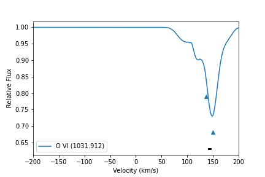

Creating and Examining Spectra
==============================

While we believe there is great value in extracting info directly out of sightlines with clever use of binning, column densities, and ratios, some analysis can only be done with realistically generated spectra. This includes velocity analysis and component alignment analysis. So, here we include a number of tools for creating and easily plotting the results of spectra, as well as analysis tools to detect components.

Creating Spectra
^^^^^^^^^^^^^^^^

To create a spectrum, you need start and end points. If you've generated points from quasarscan already (see :doc:`Creating Sightlines <../creatingsightlines>`), those will work fine, but any unitary points will work. This is a minimal script here. If you get a line with nothing in it (we'll show how to display your line below), put the location of a galaxy for the 'center' in unitary length. By design, this creates a custom instrument with arbitrary resolution and which includes the line of interest in its redshift range -- but depending on your code's redshift, this might not align at all with COS or another real instrument!

.. code-block:: python

 import yt
 from quasarscan.spectra.run_sightlines import run_line

 sim_name = 'EXAMPLE'
 sightline_num = 0
 fname = '/loc/of/snapshot.hdf5'
 ds = yt.load(fname)
 center = ds.arr([0.5,0.5,0.5],'unitary')
 start = center+ds.arr([0.05,0.05,0.05],'unitary')
 end =   center-ds.arr([0.05,0.05,0.05],'unitary')
 line_list = [('O VI', 1031.912)]
 
 run_line(sim_name,sightline_num,ds,start,end,line_list)
 
The above code creates a series of files, one for each line given (so in this case, just one). It's located in ``~/spectra_from_trident/Ion_Spectra/EXAMPLE/<sim-exact-redshift>/Line_0/O/O VI_1031.912.txt``. These folders are overkill for now, but they are very useful when you run many sightlines with multiple absorption lines in each one. What's in that file is a set of ``wavelength[A]``, ``tau``, ``flux``, and  ``flux_error``, where the first and third columns are used as x-y coordinates for plotting spectra.

The list of arguments for ``run_line`` is shown here:

* sim_name: ``str`` The simulation name. This doesn't interact with the name from other parts of ``quasarscan``, this is just for categorizing the file it saves
* sightline_num: ``int`` This also just is used for categorizing the file (assuming you make multiple lines through it)
* ``ds``: the (preloaded) yt ``Dataset``
* ``start``: ``list`` or ``array`` of three points, where to start the sightline. Trident takes points as ``unitary`` meaning all three dimensions should be between 0 and 1.
* ``end`` : ``list`` or ``array`` of three points. Same conditions as ``start``
* ``lines``: ``list`` of tuples, where the first element of each tuple is the ion name, and the second element is the rest wavelength of the transition. You can access these easily using the function ``quasarscan.spectra.trident_interfacer.get_line_list``
* ``loc = 'default'``: ``str`` where to write spectra to. The names of the internal folders are hard-coded, but the location of the root directory can be specified here.
* ``metal_function = None``: This can only be ``None`` or ``agora`` for now. If None, use ``trident`` default metals, if ``agora`` then use the agora-specific metal loading system (currently only available on my fork of ``trident``)
* ``line_spec_width = 15``: ``float`` how large to make the output file in angstroms, on either side of the rest-frame wavelength
* ``dlambda = 0.1``: ``float`` The spectral resolution. I personally think idealized spectra are more useful for analysis, but you can make this coarser to be more like observations, or to be more memory efficient.

NOTE: running this in a cosmological simulation with default ``trident`` installed will cause some weird behavior. This is because ``trident`` by default redshifts the line relative to its length, with the line starting point at the redshift of the box, and then blueshifted with distance. This gives a bias towards negative velocities. In my personal fork of ``trident`` this code is replaced with the constant redshift of the box, meaning velocities will be more accurate (but many clouds far away from each other, like the Lyman alpha forest, will no longer work properly).

Interpreting Spectra
^^^^^^^^^^^^^^^^^^^^

One important thing to do with spectra is identify absorption lines. The way this code is set up, there is no possibility of "line confusion" or anything like that, as each file is only a single line (within 15 or so angstroms). We use the Trident built-in fitter for the absorption lines to identify velocity components. This doesn't perfectly identify the lines, but it does quite well. We also group together many  aligned lines into "components" within 15 km/s of each other. The following code identifies lines:

.. code-block:: python

 from quasarscan.spectra.spectrum_analysis import load_file
 from quasarscan.spectra.trident_interfacer import call_trident_fitter
 from quasarscan.spectra.trident_interfacer import one_line_interpreter
 from quasarscan.spectra.data_objects import alignment_checker

 f_name = '~/spectra_from_trident/Ion_Spectra/EXAMPLE/<sim-exact-redshift>/Line_0/O/O VI_1031.912.txt'
 wl,fl,redshift = load_file(f_name)
 line = ('O VI', 1031.912)
 fitted_lines, fitted_flux = call_trident_fitter(wl,fl,line = line)
 checked_line = one_line_interpreter(wl, fl, fitted_lines, redshift, line, 0.95,bv_adjust = bv_adjust)
 check_lines = [checked_line]
 comps = alignment_checker(check_lines, 15)
 
The list of arguments for ``call_trident_fitter`` is shown here. This returns a dictionary of lines, containing their wavelength, b parameter, equivalent width, etc.:

* wavelength: ``array`` numpy array of wavelengths (returned by ``load_file``)
* flux: ``array`` numpy array of fluxes at each wavelength (returned by ``load_file``)
* trident_filename=``default``: ``str`` This uses the list of lines trident uses, stored inside your trident source code directory. If you installed ``trident`` at your home directory (either the base version or my fork), this should work fine.
* line = None: ``tuple`` where the first element is the ion name, and the second element is the rest wavelength of the transition. You can access these easily using the function ``quasarscan.spectra.trident_interfacer.get_line_list``. If None, it will return empty dictionaries.
* maxNumComps = 8: ``int`` number of components to attempt fitting at once. Default is 8, as that is what ``trident`` does by default. 
* ``kwargs``: ``dict`` of other args for the call to ``trident.absorption_spectrum.absorption_spectrum_fit.generate_total_fit``. See the trident documentation for details

A few of these features rely on using my fork of ``trident`` (such as being able to change maxNumComps), though this turns out not to matter very much for most purposes.

The list of arguments for ``one_line_interpreter`` is shown here. This takes that dictionary of lines and creates a list of AbsorptionLine objects, which can access some of the above values more easily (and do things like plotting itself):

* wl: ``array`` numpy array of wavelengths (returned by ``load_file``)
* fl: ``array`` numpy array of fluxes at each wavelength (returned by ``load_file``)
* fitted_lines: ``dict`` of lines returned by ``call_trident_fitter``
* cosmo_redshift: ``float``, the redshift of the simulation
* ``line``: ``tuple``, where the first element is the ion name, and the second element is the rest wavelength of the transition. You can access these easily using the function ``quasarscan.spectra.trident_interfacer.get_line_list``
* fluxthreshold = 0.99: ``float``, minimum value of flux before a line is "counted"
* bv_adjust = None: ``float`` velocity offset of the sightline relative to the bulk velocity of the halo in question in km/s. If None, just report physical velocities
* loud = False: ``bool`` if True, print the lines as they are made

``alignment_checker`` takes in this list of ``AbsorptionLines``, and returns a list of ``Components``, each of which includes a list of all the lines within a certain velocity of one another. 

Plotting Spectra
^^^^^^^^^^^^^^^^

Now that we've found the lines in our spectra, we can pretty easily plot the data. It's generally most useful to plot them in velocity space, because as we said it is most useful to check alignments between lines, rather than just getting column densities, which in a simulation we can extract much more straightforwardly. However, both velocity space and wavelength space plots are available.

.. code-block:: python

 from quasarscan.spectra.spectrum_analysis import load_file,plot_vel_around_line
 import matplotlib.pyplot as plt
 
 f_name1 = '~/spectra_from_trident/Ion_Spectra/EXAMPLE/<sim-exact-redshift>/Line_0/O/O VI_1031.912.txt'
 wl,fl,redshift = load_file(f_name)
 line = ('O VI', 1031.912)
 ax = plot_vel_around_line(wl,fl,line,redshift,left_distance = 200) 
 #if you've saved some lines and components
 for l in check_lines:
     l.plot_data(ax)
 for c in comps: 
     c.plot_data(ax)
     

     
Here the actual spectrum is plotted in blue, and the detected lines as blue triangles. Components (which, generally, would contain multiple lines) are a black bar plotted below all the detected line indicators.

The list of arguments for ``plot_vel_around_line`` is shown here.

* wl: ``array`` numpy array of wavelengths (returned by ``load_file``)
* fl: ``array`` numpy array of fluxes at each wavelength (returned by ``load_file``)
* line = None: ``tuple`` where the first element is the ion name, and the second element is the rest wavelength of the transition. You can access these easily using the function ``quasarscan.spectra.trident_interfacer.get_line_list``. If None, it will return empty dictionaries.
* cosmo_redshift: ``float``, the redshift of the simulation
* noise = 0: ``float``, standard deviation of a noise vector. Because fluxes are normalized, this is 1/SNR if you prefer to use a signal-to-noise ratio.
* color = 'default': ``matplotlib`` color variable. If ``default``, then look up if this line has a default color, otherwise use matplotlib defaults
* left_distance = 200: ``float`` velocity to extend to on left of rest velocity
* right_distance = ``default``: ``float`` velocity to extend to on right of rest velocity. By default, use same as ``left_distance``.
* label = 'default': ``str`` label to send to matplotlib for legend (but you will have to call ``legend`` yourself)
* ax = None: ``matplotlib.Axis``. The axis on which to plot the data. If None, make a new axis (return it at end)
* plot_chunk = 'lims': ``'lims'``, ``'all'``, or ``float``. If ``lims``, plot only data within the distances that will be shown. If ``all``, plot all the data, even though it would not be shown. If ``float``, plot only within ``plot_chunk`` in velocity space of the center, regardless of what will be shown
* bv_adjust = None: ``float`` velocity offset, will be added to the x axis.